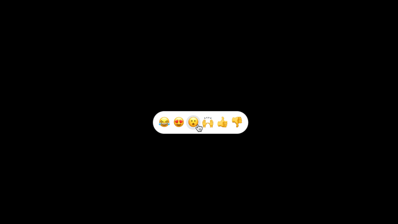

# loom/reactions

This is the open-source Tailwindcss version of Looms's beautiful Emoji Toolbar React component to react to anything.



## Demo

View the demo here: https://reaction-demo.vercel.app

## Installation

### Requirements

- `tailwindcss`
- `tailwindcss-animate`

It's pretty easy to install. I made it a standalone component that you can copy in your codebase.

1. Copy the `toolbar` component

   ```sh
   cp ./app/toolbar.tsx your-project/components/toolbar.tsx
   ```

   or go directly to it here: [toolbar.tsx](https://github.com/mfts/reaction-demo/blob/main/app/toolbar.tsx)

2. Add keyframes and animation to your `tailwind.config.ts`

   ```ts
   import type { Config } from "tailwindcss";

   const config: Config = {
     content: [
       "./pages/**/*.{js,ts,jsx,tsx,mdx}",
       "./components/**/*.{js,ts,jsx,tsx,mdx}",
       "./app/**/*.{js,ts,jsx,tsx,mdx}",
     ],
     theme: {
       fontFamily: {
         emoji: [
           "Twemoji Mozilla",
           "Apple Color Emoji",
           "Noto Color Emoji",
           "Segoe UI Emoji",
           "Segoe UI Symbol",
           "Segoe UI",
           "EmojiOne Color",
           "Android Emoji",
         ],
       },
       extend: {
         keyframes: {
           flyEmoji: {
             "0%": {
               transform: "translateY(0) scale(1)",
               opacity: "0.7",
             },
             "100%": {
               transform: "translateY(-150px) scale(2)",
               opacity: "0",
             },
           },
         },
         animation: {
           flyEmoji: "flyEmoji 1s forwards",
         },
       },
     },
     plugins: [require("tailwindcss-animate")],
   };
   export default config;
   ```

3. Import into your page

   ```ts
   import { Toolbar } from "@/components/toolbar";

   export default function Home() {
     return (
       <>
         // ...
         <Toolbar />
         // ...
       </>
     );
   }
   ```

4. Change the emojis in the `REACTIONS` object in `toolbar.tsx`

   ```tsx
   // ...
   const REACTIONS = [
     {
       emoji: "😂",
       label: "joy",
     },
     {
       emoji: "😍",
       label: "love",
     },
     {
       emoji: "😮",
       label: "wow",
     },
     {
       emoji: "🙌",
       label: "yay",
     },
     {
       emoji: "👍",
       label: "up",
     },
     {
       emoji: "👎",
       label: "down",
     },
   ];
   ```

## Future Ideas

- `onClick` handler
- `size` prop to adjust the size of the toolbar
- dark mode support

## Inspiration

- Thanks to the [@loom](https://x.com/loom) design team for the awesome component.
- Thanks to [@shadcn](https://x.com/shadcn) who gave me a new joy for UI design.
